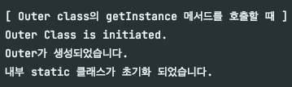
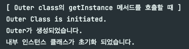

# 해당 test를 하게된 이유
디자인패턴 "싱글톤"을 공부하는 중, InnerClass로 하면 멀티스레드에 안전하다는 말이 나왔다. 그런데, 왜 안전한가? 에 대한 설명이 부족했다. 
물론, 나의 지식도 부족했다. 그래서 직접 찾아보고 있었다. 원래라면 더 삽질을 했겠지만, 구세주 같은 글을 발견했고, 그 분 덕분에 쉽게 알아볼 수 있었다.  

[해당 링크가 내가 참고한 글이다.](https://kdhyo98.tistory.com/70#static%EC%-D%B-%--%EC%--%AC%EB%-D%BC%EA%B-%--%EB%-A%--%--%EC%-B%-C%EC%A-%--)

# 테스트 초기에 했던 생각들 
- class load와 initialization은 다르다.
- static이 무조건 클래스와 함께 메모리에 올라가는 줄 알았으나... 이 또한 초기화가 필요한 기작이었다.
  - static 블록은 객체 초기화가 되지 않으면 실행되지 않는다.
  - 내부 static 클래스 또한 객체 초기화가 되지 않으면 실행되지 않는다.
    - 그래서 싱글톤, 지연로딩, 멀티스레드 안전 인가보다..!
- 처음에는 static 변수만 호출해도 static 블록이 전부 호출될 것이라고 생각했으나, 오산이었다. 
  - static 변수, static 메서드는 사용 가능하다.


# 더 나아가기
### 그럼, 내부 인스턴스 클래스는 어떨까?
- 바로 초기화가 될것이라고 생각했으나, 또 오산이었다. (오산 너무 좋아하는듯;)
  - 생각과는 다르게 아무 일도 일어나지 않음.
- 그렇다면 혹시, `new Outer()`를 `static` 상수로 만들어주는 쪽이 초기화가 되는걸까 ?? 라는 생각에 아래와 같은 테스트를 수행했다.
  - 추측이 맞았다. `static INSTANCE`가 호출이 되면서 해당 내부 클래스가 초기화 되는 것이었다. (static이든 instance든 상관이 없는 것 같다.)

### 내부 스태틱 클래스에서 Outer객체를 만들어 줄 때
```java
private static class Inner {  // Outer class가 초기화 될 때 함께 초기화 된다!!

    private static final Outer INSTANCE = new Outer();  // 해당 객체는 Inner 클래스가 초기화 될 때 생성된다.

    static {
        System.out.println("내부 static 클래스가 초기화 되었습니다.");  // 그래서 지연 로딩이라고 하신듯.
    }

    public Inner() {
        System.out.println("Inner가 생성되었습니다.");
    }
}

public static Outer getInstance() {
    return Inner.INSTANCE;
}
```



### 내부 인스턴스 클래스에서 Outer객체를 만들어 줄 때
```java
public class InnerInstanceClass {

    public static final Outer INSTANCE = new Outer();

    static {
        System.out.println("내부 인스턴스 클래스가 초기화 되었습니다.");
    }
}

public static Outer getInstance() {
    return InnerInstanceClass.INSTANCE;
}
```



# 결론
- 원래 예상했던 것
  - `getInstance`로 싱글톤 `Outer`객체 획득
  - `Outer`의 초기화로 인해 `Inner`클래스도 덩달아 초기화

가 아니었다. 위와 같이 생각한 내가 바보지... 브레이크 포인트를 찍고 디버깅을 해보니 아래와 같은 순서로 수행되는 것을 확인했다.

## Outer class의 스태틱 메서드를 호출한 경우
1. `Outer`의 `static`블록 실행 (상수는 이미 할당 돼있음. 상수풀에 미리 올라가는 듯)
2. 메서드 실행 
3. 끝


## Outer class의 상수를 호출한 경우
1. 상수 호출
2. 끝


## Outer class의 getInstance를 호출한 경우 
1. `Outer`의 `static`블록 실행 (상수는 이미 할당 돼있음. 상수풀에 미리 올라가는 듯)
2. `getInstance`메서드 실행 
3. `Inner`클래스의 스태틱 상수인 `INSTANCE` 호출 (이 때 `INSTANCE` = `null`)
4. `INSTANCE`가 호출될 때 `new Outer()`를 통해 초기화 됨 
5. `Inner`클래스의 `static`블록 실행
6. `getInstance()`가 만들어진 객체 반환 
